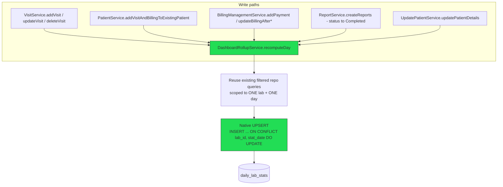
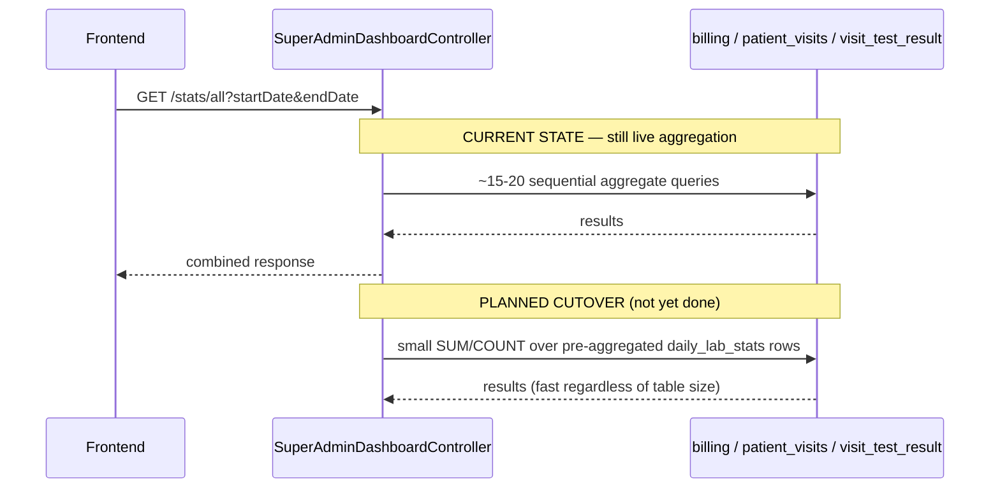
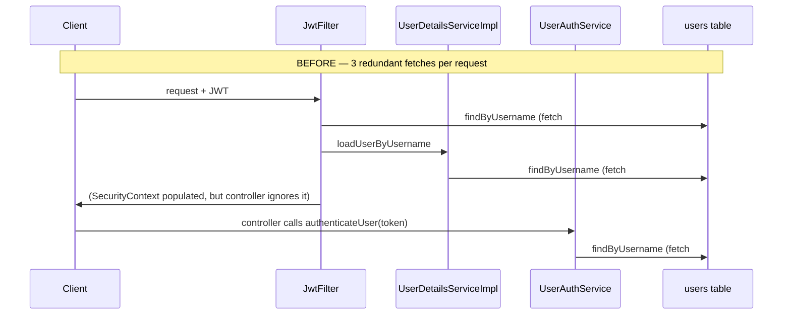
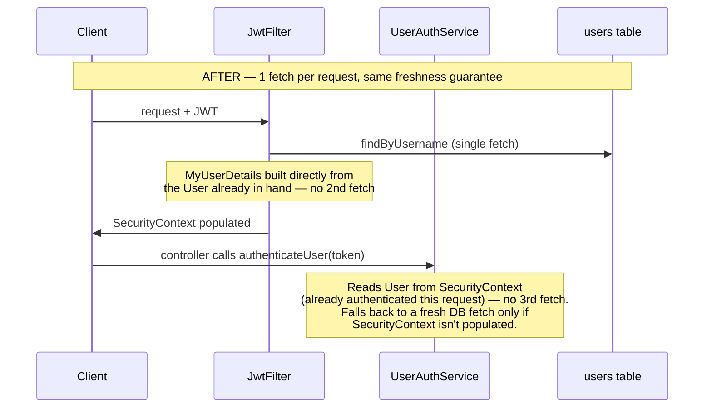
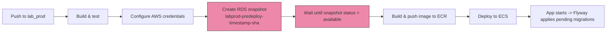

# Super Admin Dashboard Performance & Auth Optimization

This document covers three related changes made in one work session: the super-admin dashboard rollup architecture, the redundant-DB-fetch fix in JWT authentication, and the deployment-safety automation (Flyway migrations + RDS snapshots) that supports them. It explains **what** changed, **why**, and **what problem each solves**, with flow diagrams for the architecture.

---

## 1. Problem statement

`GET /lab-super-admin/stats/all` (`SuperAdminDashboardController.getAllStats`) was slow in production. Root cause: the endpoint runs ~15-20 sequential native/JPQL aggregate queries per request, scanning `billing`, `patient_visits`, and `visit_test_result` live, with zero caching. At ~20k+ transactional rows this compounds into multi-second response times, and it gets worse — not better — as data grows, since every request re-scans and re-aggregates the full history.

Separately, a related but distinct problem was found while investigating: every authenticated request was fetching the same `User` row from the database **up to 3 times** due to duplicated authentication logic between `JwtFilter` and the dashboard controllers.

---

## 2. Architecture decision: rollup table over live aggregation

### Options considered

| Option | Verdict |
|---|---|
| Cache the live query results (`@Cacheable`) | Rejected as the primary fix — doesn't reduce the cost of a cache-miss query, and date-range query params (`startDate`/`endDate`) fragment the cache into many low-hit-rate keys |
| Add missing indexes | Done as a supporting measure (already had `V11__dashboard_indexes.sql`), but doesn't change the fact that the query still scans/aggregates all matching rows every time |
| **Pre-aggregated rollup table, updated incrementally on write** | **Chosen.** Turns an O(rows) live aggregation into an O(days) lookup, regardless of how large the transactional tables grow |

### Why a rollup, not just a cache

A cache only helps repeat requests for the *same* parameters within the TTL window. A rollup table changes the fundamental cost of the query itself — reading 30 pre-summed daily rows costs the same whether the underlying `billing` table has 20,000 rows or 20,000,000.

---

## 3. The `daily_lab_stats` rollup — architecture

### Schema (`V17__create_daily_lab_stats.sql`)

One row per `(lab_id, stat_date)`, holding pre-aggregated counts and revenue for that lab and day:

```
daily_lab_stats
├── lab_id            BIGINT       -- part of composite PK
├── stat_date          DATE        -- part of composite PK
├── test_count          BIGINT
├── reports_generated    BIGINT
├── pending_samples       BIGINT
├── patient_count          BIGINT
├── paid_revenue            NUMERIC(14,2)
├── due_revenue              NUMERIC(14,2)
└── updated_at                 TIMESTAMP
```

No foreign key to `labs(lab_id)` — some environments' `labs` table (built up via `ddl-auto=update` drift over time) lacks a unique constraint on that column, which a `REFERENCES` clause requires. Skipping the FK keeps this migration purely additive: it never touches the existing `labs` table.

### Write-path: how the rollup stays in sync

**Key design decision**: `DashboardRollupService.recomputeDay(labId, date)` **reuses the exact same filtered repository queries** the live dashboard already uses (`sumPaidAmountByLabId`, `countAllTestsByLabIdAndCreatedAtBetween`, `countCompletedReportsByLabIdAndCreatedAtBetween`, `countPendingVisitsByLabIdAndCreatedAtBetween`, plus one new `countDistinctPatientsByLabIdAndCreatedAtBetween`). This guarantees the rollup can never disagree with the live dashboard's business rules (excluded-cancelled-visits, active-tests-only, `reportStatus = 'Completed'`) — because it's not reimplemented SQL, it's the same queries.

It **re-aggregates the whole day from source** every time it's called (not an incremental counter), so it self-corrects regardless of whether it's triggered by a create, an update (e.g. a partial payment arriving later), or a status change (e.g. a report marked Completed) — it cannot drift from double-counting.



**Failure isolation**: `recomputeDay` is wrapped in try/catch and never throws. A rollup failure must never fail the caller's transaction — dashboard staleness is recoverable (re-run the backfill for that day); a failed billing/visit/report save is not.

### Read-path (current state)

The dashboard's actual read queries **still hit live tables** — the cutover to reading from `daily_lab_stats` is an intentionally deferred follow-up, so numbers can be verified against the live dashboard first before user-facing reads depend on the rollup.



### Backfill / repair path

`DashboardRollupBackfillService` + `DashboardRollupAdminController` (`POST /lab-super-admin/stats/rollup/backfill?labId=&startDate=&endDate=`) — an authenticated, on-demand endpoint (not an auto-run startup job) that loops `recomputeDay` across a date range, for one lab or all labs. Built on the exact same `recomputeDay` used everywhere else, so backfilled data can never disagree with incrementally-maintained data. Safe to re-run for any date range at any time (idempotent upsert).

---

## 4. Why this doesn't affect existing data

| Change | Existing-data impact |
|---|---|
| `V17` (create `daily_lab_stats`) | None — new table only |
| Write-path hooks (`recomputeDay` calls) | None — they're additive side-effects appended *after* existing `save()` calls; they don't change what gets saved or the method's return value/behavior |
| `V19`/`V20` (sequence defaults) | None — `ALTER COLUMN SET DEFAULT` is metadata-only, doesn't rewrite existing row values |
| `V18` (email correction) | Exactly 1 row, guarded: only proceeds if exactly one row matches the old email and the target isn't taken; otherwise raises and changes nothing |
| `V21` (billing precision fix) | Rewrites the column's physical storage, not its logical value — `USING` clause preserves the actual number; fails loudly (migration aborts) rather than silently truncating out-of-range values |

---

## 5. The JWT authentication redundant-fetch fix

### Problem found

While investigating dashboard latency, a **separate but related** inefficiency was found: on every request to the super-admin dashboard, the same `User` row was fetched from the database **up to 3 times**:



Not a security bug — every fetch does return the correct user — but 3x the necessary DB round-trips for something that should cost 1, on **every single authenticated request**, not just the dashboard.

### Why caching was rejected here

Caching the `User` lookup was considered and explicitly rejected: `tokenVersion` mismatch checks and role/active-status checks are security-critical and must be fresh on every request. A cached, stale `User` would mean a revoked token or a demoted/deactivated user could keep working until the cache TTL expired — trading a real security guarantee for a small, unnecessary speed gain.

### Fix implemented (dedup, not cache)



- `JwtFilter`: builds `UserDetails` directly from the `User` already fetched for the `tokenVersion` check, instead of calling `UserDetailsServiceImpl.loadUserByUsername` (which re-fetched the same row).
- `UserAuthService.authenticateUser`: reads the already-authenticated `User` from `SecurityContextHolder` (populated by `JwtFilter` moments earlier in the same request) instead of re-parsing the token and re-querying the DB. Falls back to the original lookup logic if the context isn't populated, so behavior is unchanged in every edge case — only the redundant work is removed.

**Result**: 1 DB fetch per request instead of 3, with **zero staleness window** — every security check (`tokenVersion`, role, active status) still runs fresh on every request, just once instead of three times.

---

## 6. Deployment safety automation

### Flyway migration convention

All schema/data-fix changes ship as versioned Flyway migrations (`V{n}__description.sql`) — no manual `psql` sessions. This session added `V17`-`V21`:

| Migration | Purpose |
|---|---|
| `V17` | Create `daily_lab_stats` |
| `V18` | Guarded, single-row user email correction |
| `V19` | Wire missing sequence defaults for `password_reset_rate_limits`/`password_reset_tokens` |
| `V20` | Generic scan-and-fix for any table with a missing `id` sequence default |
| `V21` | Fix `billing.actual_received_amount` to `NUMERIC(15,2)` |

### RDS snapshot automation (`build-deploy.yml`)

Every push to `lab_prod` now automatically snapshots the production RDS database **before** deploying, and waits for the snapshot to be confirmed `available` before proceeding — so every deploy (and every Flyway migration that runs on startup) always has a fresh, deploy-specific restore point, with no manual AWS CLI steps.



This is currently only wired into the **production** pipeline (`build-deploy.yml`, `lab_prod` branch) — the test pipeline (`ci-cd-pipeline.yml`, `main` branch) does not yet have this step.

---

## 7. What's deferred / not yet done

- **Dashboard read-side cutover**: controller still reads live tables, not `daily_lab_stats`, pending verification that rollup numbers match production for a few days.
- **Per-dimension rollups** (category/payment-status/doctor/package breakdowns) beyond the top-level KPIs — same pattern, not yet built.
- **Master-data caching** (`@Cacheable` on test/package/doctor/insurance lookups, and the super-admin test-price-list endpoints) — identified as safe, high-value candidates but not yet implemented; `@EnableCaching` is not yet present anywhere in the codebase.
- **Test-environment snapshot automation** — not yet added to `ci-cd-pipeline.yml`.

## 8. Files changed this session

| File | Change |
|---|---|
| `db/migration/V17__create_daily_lab_stats.sql` … `V21__fix_billing_actual_received_amount_precision.sql` | New Flyway migrations |
| `entity/DailyLabStats.java`, `entity/DailyLabStatsId.java` | New rollup entity + composite key |
| `repository/DailyLabStatsRepository.java` | New rollup repository (native upsert) |
| `repository/VisitRepository.java` | Added `countDistinctPatientsByLabIdAndCreatedAtBetween` |
| `services/lab/DashboardRollupService.java` | New — recomputes one lab+day's rollup row |
| `services/lab/DashboardRollupBackfillService.java` | New — on-demand backfill across a date range |
| `controller/superAdmin/DashboardRollupAdminController.java` | New — backfill trigger endpoint |
| `services/lab/VisitService.java`, `PatientService.java`, `BillingManagementService.java`, `ReportService.java`, `UpdatePatientService.java` | Added `recomputeDay` hooks after every write that affects dashboard KPIs |
| `filter/JwtFilter.java` | Removed redundant `UserDetailsService` fetch |
| `utils/UserAuthService.java` | Reuse `SecurityContext`-authenticated user instead of re-fetching |
| `.github/workflows/build-deploy.yml` | Added pre-deploy RDS snapshot step |
| `postman/Dashboard-Stats.postman_collection.json` | New — login + all dashboard/rollup endpoints for testing |
