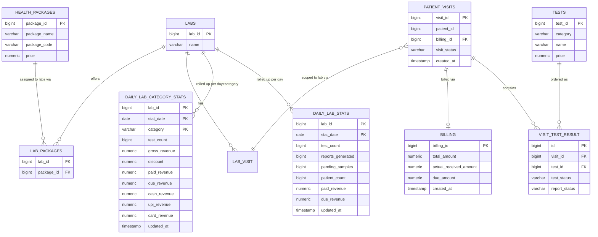
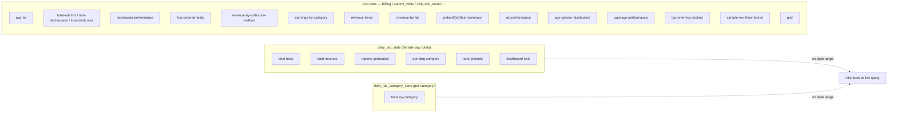
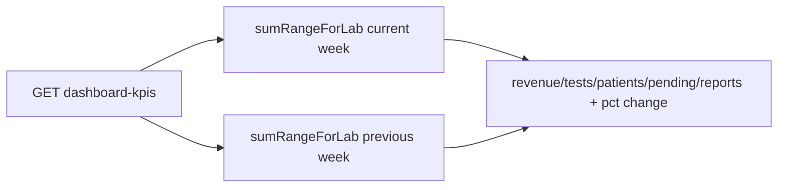
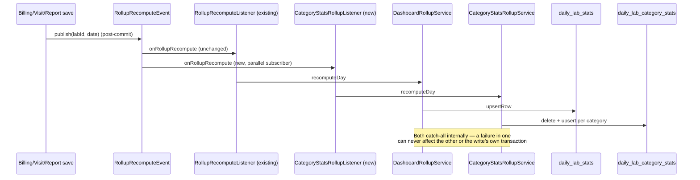
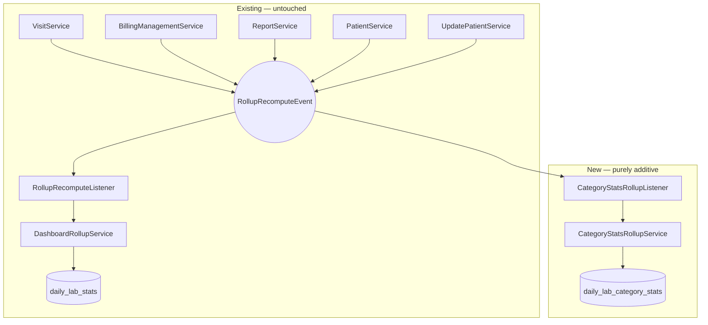
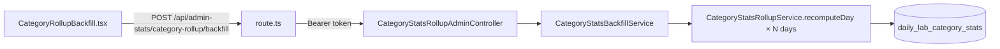

# Change Summary — Full Admin Dashboard Rollup

**Repo:** `Lab-automation` (backend) + `tiameds` monorepo, `apps/lab-app` (frontend)
**Branch:** `feat/split_service`
**Scope:** Bring the Full Admin (`ADMIN` role, `/lab-admin/stats/**`) dashboard onto the same
pre-aggregated rollup pattern already shipped for Super Admin (`daily_lab_stats`), without
touching the existing Super Admin rollup, its write hooks, or any other write path.

---

## Why

`AdminStatsController` (Full Admin, single-lab-scoped) was 100% live-aggregated — every KPI
card re-ran joins across `billing` / `patient_visits` / `visit_test_result` on every request.
`SuperAdminDashboardController` already had a working rollup pattern (`daily_lab_stats`,
`DashboardRollupService`, event-driven sync). The goal was to reuse that pattern for Full Admin
KPIs and extend it with a new per-category breakdown table, **without editing any existing
write-path file or the existing Super Admin rollup service**.

---

## ER Diagram — Rollup Tables vs. Source Tables

`DAILY_LAB_STATS` and `DAILY_LAB_CATEGORY_STATS` are not foreign-keyed to any source table — they
are re-derived (not incrementally updated) from `PATIENT_VISITS` / `VISIT_TEST_RESULT` / `BILLING`
every time `recomputeDay(labId, date)` runs, which is why they can never drift from
double-counting.

---

## KPI → Data Source Map

Every `/lab-admin/stats/**` endpoint, and exactly which table it reads from after this change.
Two endpoints read from a rollup table only when a date range is supplied — without one, they
fall back to the original live query (rollups are per-day, so an "all-time" request has no
natural rollup source).

| Endpoint | Data source | Notes |
|---|---|---|
| `total-tests` | `daily_lab_stats` | Live fallback if no date range |
| `total-revenue` | `daily_lab_stats` | Live fallback if no date range |
| `reports-generated` | `daily_lab_stats` | Live fallback if no date range |
| `pending-samples` | `daily_lab_stats` | Live fallback if no date range |
| `total-patients` | `daily_lab_stats` | Live fallback if no date range |
| `dashboard-kpis` | `daily_lab_stats` | Always date-ranged (current/previous week) — always rollup |
| `tests-by-category` | `daily_lab_category_stats` | Live fallback if no date range; **requires backfill for historical dates** |
| `avg-tat` | live (`visit_test_result` / `patient_visits` / `lab_report`) | Not stored in either rollup |
| `total-admins` / `total-technicians` / `total-deskroles` | live (`users` / `users_roles`) | Role counts, not visit/billing data |
| `technician-performance` | live | Per-technician breakdown, unbounded cardinality |
| `top-ordered-tests` | live | Per-test breakdown, unbounded cardinality |
| `revenue-by-collection-method` | live | Cash/UPI/card split not stored in rollup |
| `earnings-by-category` | live | Duplicate of `tests-by-category`'s data, not yet wired to `daily_lab_category_stats` |
| `revenue-trend` | live | Day-by-day series, not a single-row aggregate |
| `revenue-by-lab` | live | Cross-lab, not really a Full Admin (single-lab) concern |
| `patient/{id}/test-summary` | live | Single-patient lookup, not an aggregate |
| `lab-performance` | live | Overlaps `dashboard-kpis` but left untouched |
| `age-gender-distribution` | live | Demographic breakdown not stored in either rollup |
| `package-performance` | live | Per-package breakdown, unbounded cardinality |
| `top-referring-doctors` | live | Per-doctor breakdown, unbounded cardinality |
| `sample-workflow-funnel` | live | Multi-stage funnel counts, no stage granularity in rollup |
| `grid` | live | Raw per-billing-row listing, not an aggregate by definition |
| `my-labs/count` | live (`labs` membership) | Not lab-scoped, no rollup applies |
| `all` | mixed | Combined endpoint — internally calls the same builders as the rows above, so it inherits each one's source |
| `category-rollup/backfill` (new) | writes `daily_lab_category_stats` | Admin action, not a read |

---

## 1. Full Admin KPIs → `daily_lab_stats` (existing rollup, new consumer)

`DailyLabStatsRepository.sumRangeForLab(labId, start, end)` already existed for Super Admin.
Six `AdminStatsController` endpoints were switched to call it whenever a date range is supplied
(falls back to the original live query when no range is given, since the rollup is per-day):

| Endpoint | Before | After |
|---|---|---|
| `total-tests` | live COUNT join | `sumRangeForLab(...).testCount` |
| `total-revenue` | live SUM join | `sumRangeForLab(...).paidRevenue` |
| `reports-generated` | live COUNT join | `sumRangeForLab(...).reportsGenerated` |
| `pending-samples` | live COUNT join | `sumRangeForLab(...).pendingSamples` |
| `total-patients` | live COUNT join | `sumRangeForLab(...).patientCount` |
| `dashboard-kpis` | **10** live queries (5 metrics × current/previous week) | **2** rollup queries |

**Not changed:** `avg-tat`, role counts (`total-admins`/`total-technicians`/`total-deskroles`) —
not stored in the rollup row, still live.

---

## 2. New rollup: `daily_lab_category_stats` (tests-by-category breakdown)

`daily_lab_stats` only stores flat lab+day totals — no dimension for category. A brand-new,
independent rollup table was added so `tests-by-category` can also read pre-aggregated data.

**New components**

| Component | Purpose |
|---|---|
| `V41__create_daily_lab_category_stats.sql` | New table, `(lab_id, stat_date, category)` composite PK — additive only, no existing schema touched |
| `entity/DailyLabCategoryStats.java`, `DailyLabCategoryStatsId.java` | Composite-key rollup row |
| `repository/DailyLabCategoryStatsRepository.java` | `upsertRow(...)`, `sumRangeByCategoryForLab(...)` |
| `services/lab/CategoryStatsRollupService.java` | `recomputeDay(labId, date)` — re-aggregates one lab+day from `visitTestResultRepository.getPatientTestsByCategoryDetailedByLabIdWithDateRange` (the same query the live dashboard already trusts); **never throws** |
| `services/lab/CategoryStatsRollupListener.java` | **Second subscriber** to the existing `RollupRecomputeEvent` |
| `services/lab/CategoryStatsBackfillService.java` | `backfillLab` / `backfillAllLabs` — idempotent historical backfill |
| `controller/admin/CategoryStatsRollupAdminController.java` | `POST /lab-admin/stats/category-rollup/backfill` |

### Isolation strategy — the key design decision

Spring supports multiple `@EventListener`/`@TransactionalEventListener` subscribers per event.
`RollupRecomputeEvent` was already published by `VisitService`, `BillingManagementService`,
`ReportService`, `PatientService`, `UpdatePatientService` for the existing `daily_lab_stats`
rollup. Adding `CategoryStatsRollupListener` as a **second, independent subscriber** to that
same event required **zero changes** to any of those five write-path files, the existing
`RollupRecomputeListener`, or `DashboardRollupService`.

---

## 3. Frontend — no dashboard rendering changes needed

`apps/lab-app`'s `AdminStats.tsx` reads plain named fields (`totalTests`, `categories[]`, etc.)
off the response envelope. Since every rollup-backed backend response kept its shape identical,
the display components required **zero changes**.

**What *was* added (frontend):**

| File | Change |
|---|---|
| `api/admin-stats/[...path]/route.ts` | Added `POST` support (proxy only forwarded `GET` before) |
| `services/adminStatService.ts` | Added `post<T>()` helper + `triggerCategoryRollupBackfill(labId, startDate, endDate)` |
| `types/adminStatsData.ts` | Added `CategoryRollupBackfillResult` type |
| `component/lab/CategoryRollupBackfill.tsx` (new) | Manual backfill trigger UI (date range + button) |
| `(admin)/dashboard/lab/page.tsx` | New "Category Rollup" tab, visible to `ADMIN`/`SUPERADMIN` |

---

## Verification performed

- `mvn compile` — clean build after each change set.
- Live dev run: logged in as an `ADMIN`-role user, hit `dashboard-kpis`, `total-tests`,
  `total-revenue` (rollup-backed) — correct values, `0` for a week genuinely without activity
  (cross-checked against raw `daily_lab_stats` rows).
- `tests-by-category` before/after `category-rollup/backfill`: empty → populated after backfill;
  totals (`1146` tests, `BIOCHEMISTRY: 372`) matched exactly against the still-live
  `earnings-by-category` endpoint — confirms the rollup doesn't drift from live aggregation.
- No errors in server logs across the full test run.
- Frontend `tsc --noEmit`: zero errors introduced (5 pre-existing unrelated errors in PDF
  report-rendering components).

---

## Risk / Review Notes

- **Isolation is the load-bearing property of this change.** `CategoryStatsRollupService` must
  keep its try/catch-all-and-log behavior (mirrors `DashboardRollupService`) — a future edit that
  lets it throw would still be caught by Spring's async listener boundary, but could silently
  stop future category rollups from running without failing anything visibly.
- **Historical backfill is required** before trusting `tests-by-category` for any date range
  predating this deploy — the automatic listener only fires on new writes going forward.
  `POST /lab-admin/stats/category-rollup/backfill` (or the new frontend tab) must be run once per
  lab for the desired historical range.
- **Package Performance was investigated as a related report** — confirmed to be data-state, not
  a bug: a lab with zero rows in `lab_packages`, or a package with zero billed visits, correctly
  renders empty/filtered on both backend and frontend (the pie chart deliberately drops
  zero-revenue entries). No code changes were made for that investigation.
- **`earnings-by-category`** remains a live-only endpoint not yet wired to any rollup, and is
  currently unused by the frontend — a candidate for a future pass if that card is ever added.
