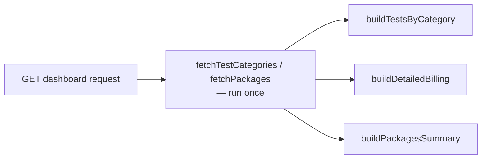
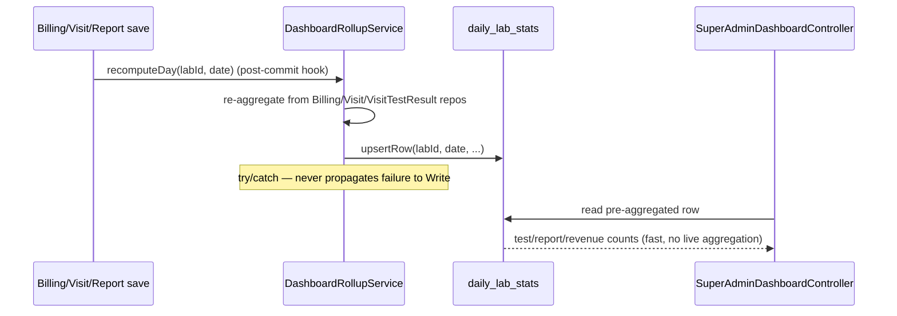
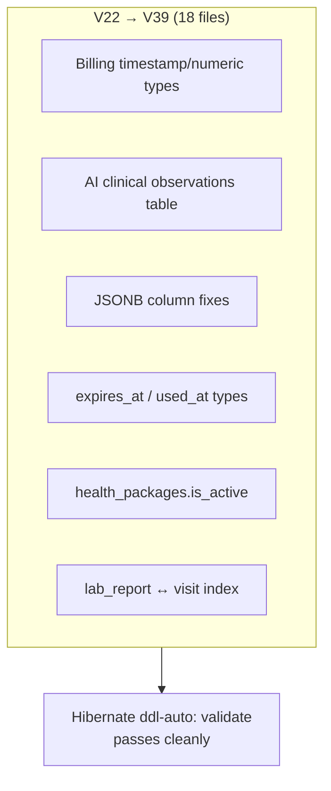
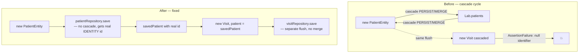
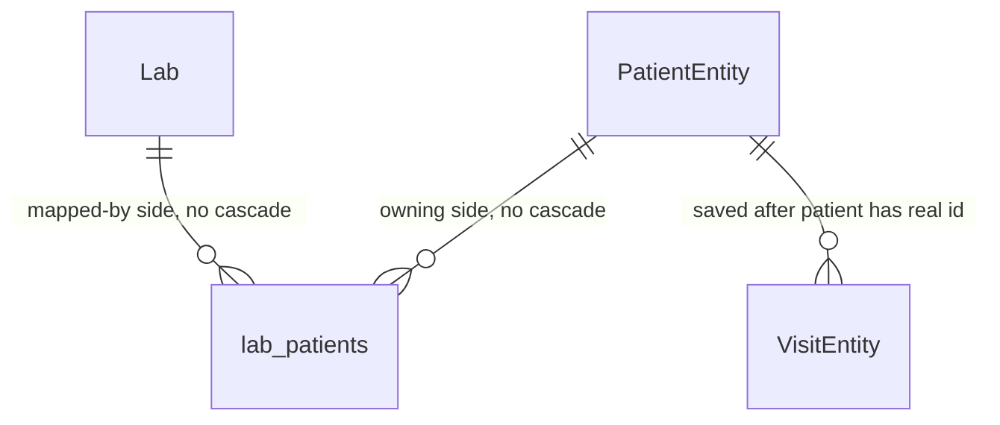
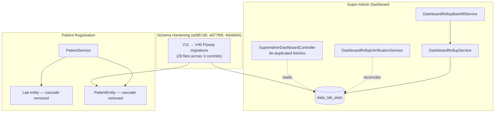

# Change Summary — Last 4 Commits (`feat/split_service`)

**Repo:** `Lab-automation`
**Branch:** `feat/split_service`
**Range:** `a0857d0` → `4dcbb64`

| # | Commit | Date | Author | Type | Summary |
|---|--------|------|--------|------|---------|
| 1 | `a0857d0` | 2026-09-02 | dipakdagadu-tech | fix | Column-type schema fixes + dashboard query de-duplication |
| 2 | `dc8da0f` | 2026-09-03 | somil-tiameds | feature | Daily lab stats rollup + backfill |
| 3 | `e677f06` | 2026-09-03 | somil-tiameds | fix | Widespread Hibernate schema-validation column fixes (V22–V39) |
| 4 | `4dcbb64` | 2026-09-03 | somil-tiameds | refactor | Patient↔Lab cascade-cycle fix (the failure this branch is named after) |

---

## 1. `a0857d0` — Column type fixes + dashboard fetch de-duplication

**Migrations:** `V11__dashboard_indexes.sql`, `V12__fix_billing_column_types.sql`,
`V13__fix_billing_transaction_column_types.sql`, `V14__fix_tests_price_column_type.sql`,
`V15__fix_timestamp_column_types.sql`

Two independent changes bundled together:

- **Schema drift fix** — several billing/test columns were declared with types
  that didn't match what Hibernate expected (money columns → `NUMERIC`,
  date/time columns → `TIMESTAMP`), causing schema-validation failures.
  Repository query methods (`BillingRepository`, `DoctorRepository`,
  `HealthPackageRepository`, `LabRepository`, `VisitTestResultRepository`,
  new `UserRepository`) were updated to match.
- **`SuperAdminDashboardController` de-duplication** — `testsByCategory`,
  `detailedBilling`, and `packagesSummary` each independently re-queried the
  same `testCategories` / `packages` data. Refactored so `fetchTestCategories`
  and `fetchPackages` run **once** per request and the results are threaded
  into all three builder methods, cutting redundant DB round-trips.

---

## 2. `dc8da0f` — Daily lab stats rollup & backfill

Introduces a pre-aggregated rollup table (`daily_lab_stats`, one row per
`lab_id` + `stat_date`) so the super-admin dashboard can read summary numbers
directly instead of re-aggregating raw billing/visit/test-result tables on
every request.

**New components**

| Component | Purpose |
|---|---|
| `entity/DailyLabStats.java`, `DailyLabStatsId.java` | Composite-key (`lab_id`, `stat_date`) rollup row |
| `repository/DailyLabStatsRepository.java` | `upsertRow(...)` — idempotent insert-or-update |
| `services/lab/DashboardRollupService.java` | `recomputeDay(labId, date)` — re-aggregates one lab+day from source tables and upserts it; **never throws** (catches internally, logs) so a rollup failure never fails the caller's billing/visit/report transaction |
| `services/lab/DashboardRollupBackfillService.java` | `backfillLab` / `backfillAllLabs` — re-runs `recomputeDay` over a date range; idempotent, safe to re-run in production |
| `controller/superAdmin/DashboardRollupAdminController.java` | Admin-triggered backfill endpoint |
| `V17__create_daily_lab_stats.sql` | Table creation |

**Design property worth noting:** `recomputeDay` always re-aggregates the
*entire* day from source rather than incrementing counters — so it is
self-correcting regardless of whether it's triggered by create, update
(partial payment), or status change (report completed), and can't drift from
double-counting.

Also adds: `RollupRecomputeEvent` / `RollupRecomputeListener` (async event
hook wiring), `RollupAsyncConfig`, and a verification service
(`DashboardRollupVerificationService`) added in the *next* commit (`e677f06`)
to cross-check rollup output against live aggregation.

---

## 3. `e677f06` — Hibernate schema-validation fixes (V22–V39)

The largest of the four commits by migration count: **18 Flyway migrations**
(`V22` → `V39`) correcting column types/precision that Hibernate's
`ddl-auto: validate` flagged as mismatched against entity definitions —
billing timestamps, numeric precision on transaction/discount amounts, JSONB
columns, `expires_at`/`used_at` timestamp types, `Instant`/`LocalDate`
mappings, and a missing `health_packages.is_active` column. Also splits
`SuperAdminStatsController` (520 lines removed) with logic absorbed into
`SuperAdminDashboardController`, and adds `DashboardRollupVerificationService`
to reconcile rollup rows against live-computed values.

---

## 4. `4dcbb64` — Patient↔Lab cascade-cycle fix

**Files:** `entity/Lab.java`, `entity/PatientEntity.java`, `services/lab/PatientService.java`
**Migration:** `V40__restore_missing_primary_keys_and_identity.sql`

Root-causes and fixes a Hibernate `AssertionFailure: null identifier
(PatientEntity)` that occurred on every new-patient save which attached an
existing `Lab`.

**Root cause:** the bidirectional `@ManyToMany` between `PatientEntity.labs`
(owning side) and `Lab.patients` (mapped-by side) had `cascade =
{PERSIST, MERGE}` on **both** sides. That creates a cascade cycle
(`Patient → labs → Lab → patients → back to the same transient Patient`)
that Hibernate can't resolve before the new `Patient` has an IDENTITY id.

**Fix — two parts:**

1. Remove cascade from both sides of the `@ManyToMany` (cascade belongs on
   one side only, and here neither side actually needs it — `Lab` is always
   already-persisted, and the join-table row is written automatically
   regardless of cascade).
2. In `PatientService`, save the new `Patient` **by itself first** (so it
   gets a real, flushed IDENTITY id), *then* attach and save the `Visit`
   separately — instead of cascading a new `Visit` into the same flush as
   the parent's own IDENTITY insert (which was silently returning a `null`
   in-memory id despite a successful INSERT), and instead of re-saving the
   already-persisted patient (which would route through `merge()` and
   return a divergent copy of the entity graph).

---

## Overall Change Footprint

---

## Risk / Review Notes

- **`4dcbb64` is the critical fix** — confirm the new save-order
  (`patient` first, then `visit` separately) is applied everywhere a
  `Patient` + `Visit` are created together, not just in the one method
  shown; any other cascading-create path with the same pattern will hit the
  same `AssertionFailure`.
- **Rollup failures are swallowed by design** (`DashboardRollupService`
  never throws) — dashboard numbers can silently go stale if
  `recomputeDay` starts failing consistently for a lab; monitor its error
  logs, and use `DashboardRollupBackfillService`/`DashboardRollupVerificationService`
  to detect and repair drift.
- **Migration volume:** 29 Flyway migrations landed across 3 commits in 2
  days, all correcting `ddl-auto: validate` mismatches — worth confirming
  `V40` was actually applied against every target environment (dev/test/prod)
  before relying on `validate` mode there, since a missed migration will
  hard-fail app startup.
- **`a0857d0` mixes an unrelated author's commit** (`dipakdagadu-tech`) with
  the following three (`somil-tiameds`) — the dashboard de-dup change and the
  column-type fix are logically separate concerns bundled into one commit;
  no action needed, just noting for review context.
